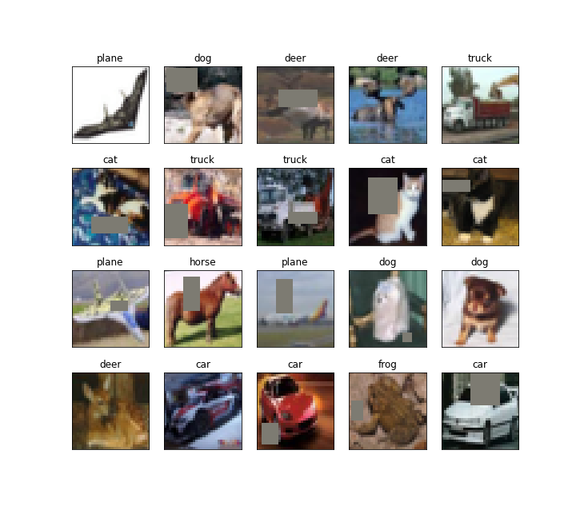
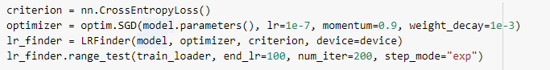
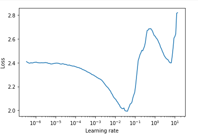
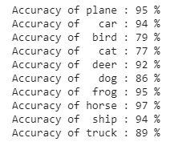
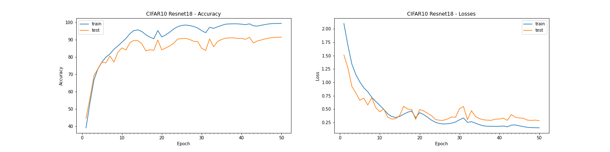
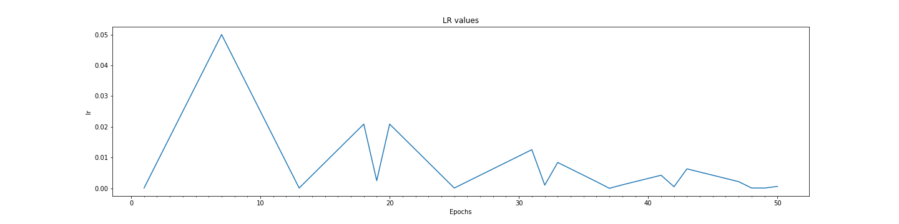

# Assignment-10: 

1. CIFAR10 Model using Resnet18 network architetcure
2. Data augmentation using albumentations library - applied cutout data augmentation
3. LRFinder to get the lr range estimate for model training
4. ReduceLrOnPlateu is applied to reduce LR when model get stuck in Plateu region
5. GradCAM for 25 misclassified images

Solution file: EVA4S9_main.ipynb
--------------------------------

### Utility Files Descriptions
------------------------------
Reusable codes are packages into their respective python files as below:

### Folders: utils, models, gradcam

Folder: \utils\
1. utils\data_utils.py: This file contaon code for loading CIFAR10 dataset, transformation fxn and data loader unitility functions
2. utils\plot_utils.py: All image handling and plotting function are packaged into thsi file. Few funtions such as visualizing images dataset, plotting model hsitory, plotting misclassified images for the built model etc.
3. utils\model_utils.py: Funtions and classes to build model. It also contains train and test functions. Various configution parameteres are profided to choose the loss and regularization selections.
it also contains building blocks for creating basic convolution blocks, transistion blocks, and depth wise seperable convoltuion layers.
4. utils\model_history.py: it define ModelHistory class whcih store epoch based result for training and test data and utility fxn for plotting model history graph
5. utils\regularization.py: L1 loss fxn
6. utils\common_utils.py: basic common fx such as checking GPU device etc
7. utils\albumentations_utils.py: data augmentation and transformation using albumentations
8. utils\lr_finder.py: utility fucntion for LR Finder

Folder: \models\
This is folder to place all models for reuse in future
1. cifar10_net_cnn.py: This file is speicifc for CIFAR10 network. it contains class for CIFAR10 network design based on custom CNN architetcure.
2. resnet.py: resnet network architetcure

Folder: \gradcam\
1. gradcam\gradcam.py: Calculate GradCAM salinecy map
2. gradcam\gradcam_utils.py: Make heatmap from mask and synthesize GradCAM result image using heatmap and img. registring of layer for whcih GradCAM to be applied.
3. gradcam\gradcam_abs.py: abstraction layer for application to use GradCAM

----------------------------------------------------------------------------------------------------------------

### Basic Implementation Strategy
-----------------------------------

1. Calculated mean and std calculation for entire CIFAR10 dataset
2. Applied Data augmentation using albumentations library: Horizontalflip, coarseDropout/cutout.
3. resnet18 based model creation.
4. Applide LR finder to get the base and max lr to be used for model training
5. build and model training using L1 and L2 regularization(weight_decay: 0.001)
6. CyclicLR with policy=triangular2
7. Appled ReduceLrOnPlateu to reduce LR when model is stuck in plateu region
7. GradCAM is used to visualize how model is performing for misclassified images

Mean and standard devistion calculation for entire dataset
----------------------------------------------------------

Total dataset(train+test) shape:  (60000, 32, 32, 3)

means: (0.49186864, 0.48265335, 0.44717798)
stds: (0.24697131, 0.24338901, 0.26159254)

Sample images of albumentations augmentation
--------------------------------------------

Data Augmentation technique: Horizontalflip, CoarseDropout

LR Finder
---------

The model is trained for num_iter iterations while the learning rate is increased from its initial value specified by the optimizer algorithm to end_lr. 

LR plot

Finder Analysis:

loss start diminisinging at lr=1e-4 and start increasing at lr=5e-2. this lr range can be used while training the network

Final Result:
-------------

1. Training best result: Accuracy: 99.43 at Epoch 49
2. Testing  best result: Accuracy: 91.55 at Epoch 50

Model Test accuracy for each classes:
-------------------------------------

Model Epoch History
-------------------

Learning rate trend for Epoch
-----------------------------

1. CyclicLR is used with "triangular2" policy.
2. ReduceLrOnPlateu is used to reduce Lr if validation loss didn't improve for patience=4 

GradCAM Results visualization for 25 misclassified images:
---------------------------------------------------------

----------------------------------------------------------------------------------------------------------------

