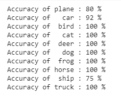
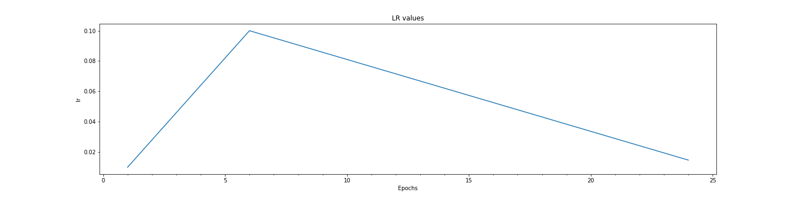

# Assignment-10: 

1. CIFAR10 Model using custom Resnet network architetcure
2. Data augmentation using albumentations library - cutout, rotattion, RandomCrop augmentation
3. LR Range Test module is implemented to find max_lr for best accuracy by running model for many epoch with linearly incrmenting Learning rate
4. On cycle Policy is impemented while training the model. Lr is incremented in iterations from min to max  value in 5 epoch and for remaining epoch lr is lineraly decrease
5. Plotting of one cycle policy

Following new files are added:
------------------------------

1. utils\lr_range_test.py: utility module to run model for many epochs to find max lr for best accuracy
2. models\resnet_custom.py: resnet arch is impemented as per the session-11 assignment

Solution file: EVA4S11_main.ipynb
--------------------------------

### Utility Files Descriptions
------------------------------
Reusable codes are packages into their respective python files as below:

### Folders: utils, models, gradcam

Folder: \utils\
1. utils\data_utils.py: This file contaon code for loading CIFAR10 dataset, transformation fxn and data loader unitility functions
2. utils\plot_utils.py: All image handling and plotting function are packaged into thsi file. Few funtions such as visualizing images dataset, plotting model hsitory, plotting misclassified images for the built model etc.
3. utils\model_utils.py: Funtions and classes to build model. It also contains train and test functions. Various configution parameteres are profided to choose the loss and regularization selections.
it also contains building blocks for creating basic convolution blocks, transistion blocks, and depth wise seperable convoltuion layers.
4. utils\model_history.py: it define ModelHistory class whcih store epoch based result for training and test data and utility fxn for plotting model history graph
5. utils\regularization.py: L1 loss fxn
6. utils\common_utils.py: basic common fx such as checking GPU device etc
7. utils\albumentations_utils.py: data augmentation and transformation using albumentations
8. utils\lr_finder.py: utility fucntion for LR Finder
9. utils\lr_range_test.py: utility module to run modle for many epoch to find max lr for best accuracy

Folder: \models\
This is folder to place all models for reuse in future
1. cifar10_net_cnn.py: This file is speicifc for CIFAR10 network. it contains class for CIFAR10 network design based on custom CNN architetcure.
2. resnet.py: resnet network architecture
3. resnet_custom.py: resnet arch is impemented as per the session-11 assignment

Folder: \gradcam\
1. gradcam\gradcam.py: Calculate GradCAM salinecy map
2. gradcam\gradcam_utils.py: Make heatmap from mask and synthesize GradCAM result image using heatmap and img. registring of layer for whcih GradCAM to be applied.
3. gradcam\gradcam_abs.py: abstraction layer for application to use GradCAM

----------------------------------------------------------------------------------------------------------------

Sample images of albumentations augmentation
--------------------------------------------

Data Augmentation technique: Horizontalflip, CoarseDropout

LR Range Test
-------------

The model is trained for 30 epochs while the learning rate is increased for each iteration from its initial value specified by the optimizer algorithm to end_lr. 
to max lr value

Range Test Analysis:

Maximun accuracy is observed for lr=0.091(max_lr)
Min lr is set as max_lr/10 = 0.0091
This lr range can be used while training the network

Final Result:
-------------
Model is trained for 24 Epochs, with increasing Lr upto 5 epochs and then decreasing till last epoch

Training best result: Accuracy: 98.55 at Epoch 24
Testing  best result: Accuracy: 89.43 at Epoch 24

Model Test accuracy for each classes:
-------------------------------------

Model Epoch History
-------------------

One Cycle Policy Plot for Learning Rate
---------------------------------------

1. One CyclicLR is used with "triangular" policy.
2. ReduceLrOnPlateu is used to reduce Lr if validation loss didn't improve for patience=4 

----------------------------------------------------------------------------------------------------------------

