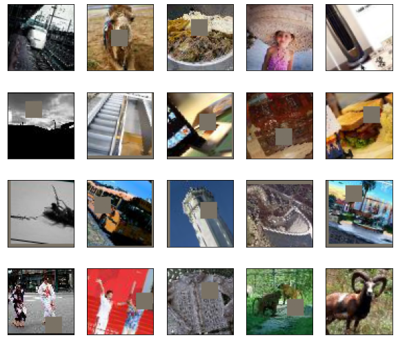
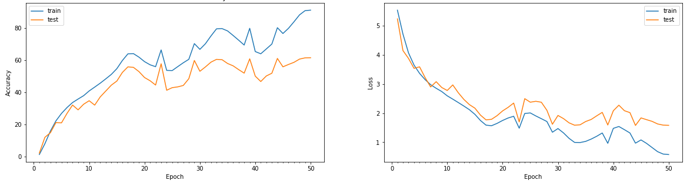
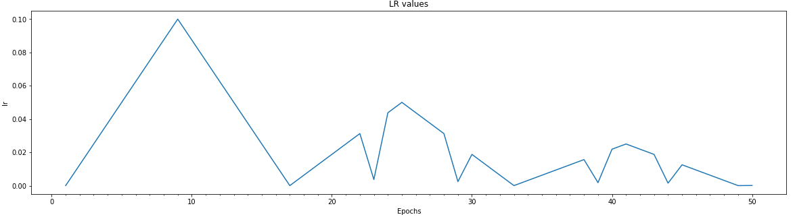

# Assignment 12-A: TINY IMAGENET DATASET

1. Download TINY IMAGENET ("http://cs231n.stanford.edu/tiny-imagenet-200.zip") dataset. 
2. Train ResNet18 on this dataset (70/30 split) for 50 Epochs. Target 50%+ Validation Accuracy.

Following new files are added:
------------------------------

1. utils\TinyImagenetDataset.py: utility module to prepare Tiny Imagenet dataset with 70:30 split

Solution file: EVA4S12A_main.ipynb
--------------

### Utility Files Descriptions
------------------------------
Reusable codes are packages into their respective python files as below:

### Folders: utils, models, gradcam

Folder: \utils\
1. utils\data_utils.py: This file contaon code for loading CIFAR10 dataset, transformation fxn and data loader unitility functions
2. utils\plot_utils.py: All image handling and plotting function are packaged into thsi file. Few funtions such as visualizing images dataset, plotting model hsitory, plotting misclassified images for the built model etc.
3. utils\model_utils.py: Funtions and classes to build model. It also contains train and test functions. Various configution parameteres are profided to choose the loss and regularization selections.
it also contains building blocks for creating basic convolution blocks, transistion blocks, and depth wise seperable convoltuion layers.
4. utils\model_history.py: it define ModelHistory class whcih store epoch based result for training and test data and utility fxn for plotting model history graph
5. utils\regularization.py: L1 loss fxn
6. utils\common_utils.py: basic common fx such as checking GPU device etc
7. utils\albumentations_utils.py: data augmentation and transformation using albumentations
8. utils\lr_finder.py: utility fucntion for LR Finder
9. utils\lr_range_test.py: utility module to run modle for many epoch to find max lr for best accuracy
10.utils\TinyImagenetDataset.py: utility module to prepare Timy image dataset with 70:30 split

Folder: \models\
This is folder to place all models for reuse in future
1. cifar10_net_cnn.py: This file is speicifc for CIFAR10 network. it contains class for CIFAR10 network design based on custom CNN architetcure.
2. resnet.py: resnet network architecture
3. resnet_custom.py: resnet arch is impemented as per the session-11 assignment

Folder: \gradcam\
1. gradcam\gradcam.py: Calculate GradCAM salinecy map
2. gradcam\gradcam_utils.py: Make heatmap from mask and synthesize GradCAM result image using heatmap and img. registring of layer for whcih GradCAM to be applied.
3. gradcam\gradcam_abs.py: abstraction layer for application to use GradCAM

----------------------------------------------------------------------------------------------------------------

Image Augmentations
-------------------

Data Augmentation technique: Cutout(16x16), RandomCrop(padding=8), HorizontalFlip, FlipLR

Final Result:
-------------

Training best result: Accuracy: 91.19 at Epoch 50
Testing  best result: Accuracy: 61.52 at Epoch 50 [50+ accuracy is acheived from epoch 16 onwards]

Model Epoch History
-------------------

Learning rate trend for Epoch
-----------------------------

1. CyclicLR is used with "triangular2" policy.
2. ReduceLrOnPlateu is used to reduce Lr if validation loss didn't improve for patience=4 

----------------------------------------------------------------------------------------------------------------

