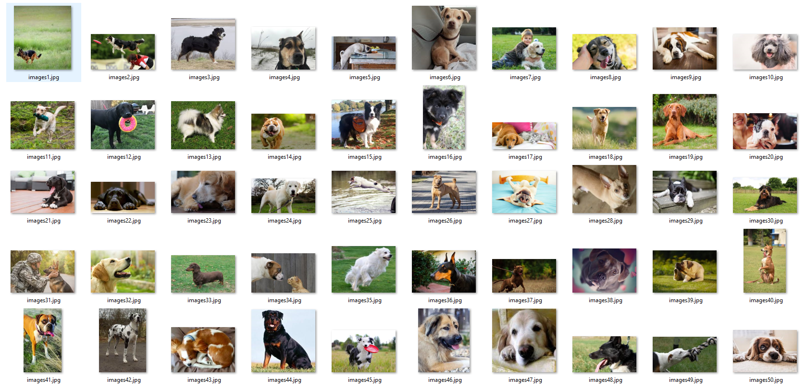
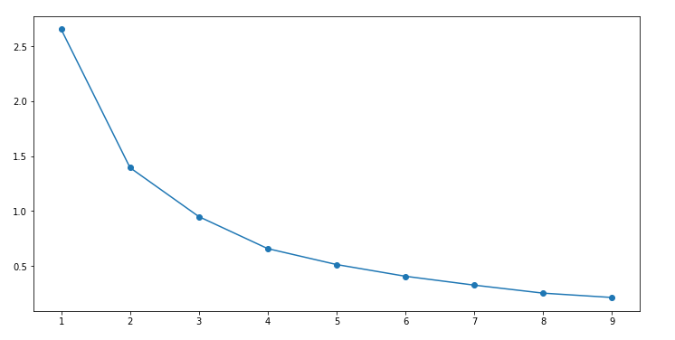
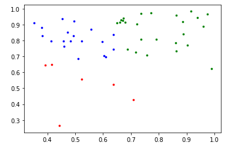

# Assignment 12-B: 

Objectives:
-----------

1. Download 50 images of dogs. 
2. Use VGG tool to annotate bounding boxes around the dogs.
3. Download JSON file. 
4. Describe the contents of this JSON file in FULL details 
5. Find out the best total numbers of clusters.

Solution file: EVA4S12_Assignment_B.ipynb.ipynb 

### Package Descriptions
------------------------

1. EVA4S12_Assignment_B.ipynb: solution file for K-Mean clustering on bounding boxes
1. dog_images: Folder contains 50 dog images
2. dog_coco_json.json: this is coco json file exported through VGG tool. it contains file and bbox attributes

----------------------------------------------------------------------------------------------------------------

### 50 dog images used for annotations
----------------------------------

### JSON File Descriptions
--------------------------

File name: dog_coco_json.json

COCO json file contains two important json elements: "images" and "annotations"

#images json element: it contains attribute for each images as below:

- "id": unique id for the images
- "file_name": image file name
- "width": width of the image in pixels
- "height": height of the image in pixels

#annotations json element: it contains annotations for each images with following attributes:
- "id": unique id for the images
- "area": this is area of the bbox region.
- "bbox": it contains four parameters in sequence as x,y,w,h where x,y are the center corodinates of the bounding box and w,h are width and height of the bbox
- "segmentation": it contains four x,y coordinates for the bounding boxes [x1,y1,x2,y2,x3,y3,x4,y4].
   x1,y1 -> x,y coordinates for top left of bbox
   x2,y2 -> x,y coordinates for top right of bbox
   x3,y3 -> x,y coordinates for bottom right of bbox
   x4,y4 -> x,y coordinates for bottom left of bbox

Normalizing images and bbox
---------------------------

To make all the bounding boxes parameter to be comparable we normalize all the images to 1X1. 
New bbox parameters are calculated by dividing with the respective image height and width as below:

- bbox_x_new = bbox_x / img_w {divided by width of the image}
- bbox_y_new = bbox_y / img_h {divided by heigth of the image}
- bbox_h_new = bbox_h / img_h {divided by width of the image}
- bbox_w_new = bbox_w / img_w {divided by heigth of the image}

Determining K-Mean clustering for bbox
--------------------------------------

1. Performing K-Mean clustering on Bounding box heights and weights(bbox_h_new, bbox_w_new)
2. Iterating values of k from 1 to 10 fit K means model and calculating c distance i.e measure for Sum of squares error.
4. draw elbow plot and get the optimal K from graph

As per below elbow plot, Optimal K is 3 as beyond this k value the distortion or sum of square error does not changes much

Mapping each images to their respective cluster
-----------------------------------------------

----------------------------------------------------------------------------------------------------------------

