## Assignment-15A: Building a custom dataset for monocular depth estimation and segmentation simultaneously

* Selct any "scene" image. we call this as background 
* Make 100 images of objects with transparent background. we call this as foreground
* Create 100 masks for above foreground images. tool like GIMP or power point can be used
* Overlay the foreground on top or background randomly. Flip foreground as well. We call this fg_bg
* Create equivalent masks for fg_bg images
* Use this or similar [Depth Models](https://github.com/ialhashim/DenseDepth/blob/master/DenseDepth.ipynb) to create depth maps for the fg_bg images:

## What dataset is created?

* For background, selected theme is "Classroom"
* For foreground objects, student or/and teacher is selected. 

## Work Items

* EVAS15_create_dataset.ipynb[(Link)](EVAS15_create_dataset.ipynb): Notebook for dataset creation.
* EVAS15_DenseDepth.ipynb[(Link)](EVAS15_DenseDepth.ipynb): Notebook for dense depth creation for fg_bg images
* EVAS15_dataset_statistic.ipynb[(Link)](EVAS15_dataset_statistic.ipynb): Notebook for describing created dataset. count, datasize, means, visualization etc

## Custom Dataset
Google drive link for all the dataset are as below:

* bg images[(Link)](https://drive.google.com/open?id=1wjRX9h8PhaS2iJN4A0utlNhZkvsiUAMW): Square shape (192X192) background images
* fg images[(Link)](https://drive.google.com/open?id=1e3Pp7zMZOiXGqrRbblRVxO3q_0Ch0m3-): Foreground images
* fg_mask images[(Link)](https://drive.google.com/open?id=1Phw6KL1z2dbRpvOB369LyZLnWMo2nY-d): Mask for fg images
* fg_bg images[(Link)](https://drive.google.com/open?id=14txr_9iw6Vjfc7p4d-daAtq21-makeH_): each fg images are overlays randomly 20 time on the background. same thing is repeated for Flip images. Hence 40 images are created for each fg ovelay on each bg.
* fg_bg_mask images[(Link)](https://drive.google.com/open?id=14w2EIrHrVR3MMCw00wvz0k9RelG_sQ10): Equivalent mask for fg_bg images
* fg_bg_depth images[(Link)](https://drive.google.com/open?id=1-1aTnL5x5vwQgk-24mENomq9MQuxCPjW): Depth images for fg_bg
 
## Results 
Let's have quick summary of dataset and visulaization for each kind of images

*Dataset statistics*

<p align="center">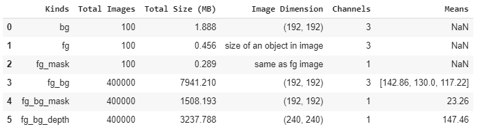</p>

*Dataset visualization*
Below plot show the randomly selected images from the custom dataset.
* bg images
* fg images
* fg_mask images
* fg_bg images
* fg_bg_mask images
* fg_bg_depth images

<p align="center">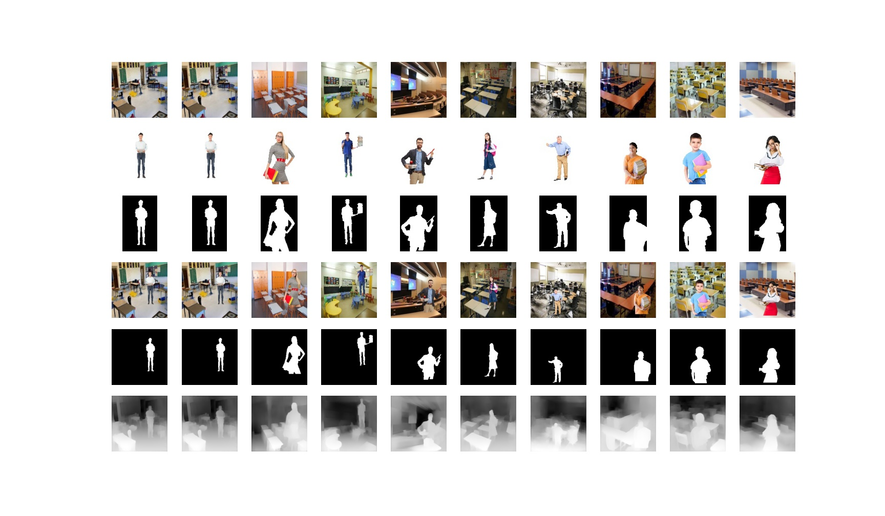</p>


## How fg is overlay over bg?

* bg, fg, fg_mask are the inputs images and using these images fg_bg and equivalent maks is created

`
bg_img -> background image
`
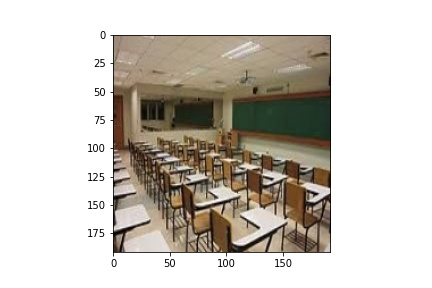

`
fg_img -> forfround image
`
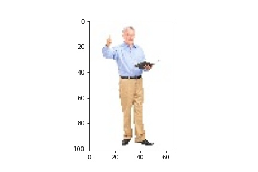

`
fg_mask -> foreground mask image
`
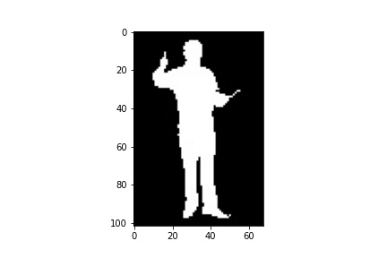

``
# Create forground image with black background.
fg_img_with_mask = cv2.bitwise_and(fg_img, fg_mask)
``
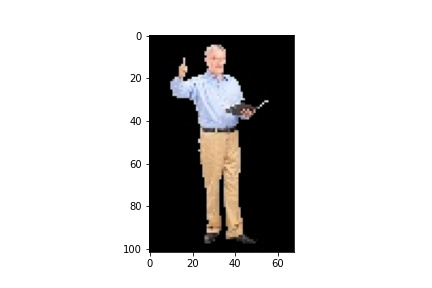

``
# choose random locations for masking. start location is choosen such that fg image get fits within bg image.
h_start = np.random.randint(0,bg_img.shape[0]-h)
w_start= np.random.randint(0,bg_img.shape[1]-w)
``

``
# create mask for fg and bg overlay images 
fg_bg_mask = np.zeros(bg_img.shape, bg_img.dtype)
fg_bg_mask.fill(0)
fg_bg_mask[h_start:h_start+h, w_start:w_start+w] = fg_mask[:,:]
``
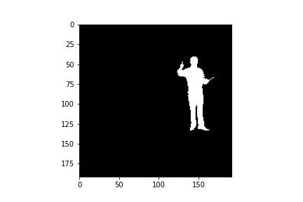

``
fg_bg_mask_inv = cv2.bitwise_not(fg_bg_mask)
``
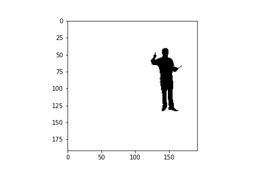

``
# background image with foreground portion filled with black
bg_overlay = cv2.bitwise_and(bg_img, fg_bg_mask_inv)
``
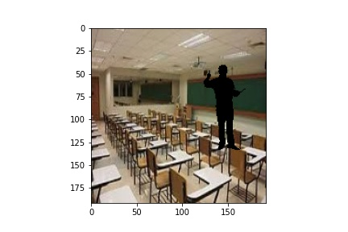

``
# image with only forground portion is filled and remining background is kept black
fg_overlay = np.zeros(bg_img.shape, bg_img.dtype)
fg_overlay.fill(0)
fg_overlay[h_start:h_start+h, w_start:w_start+w] = fg_img_with_mask[:,:]
``
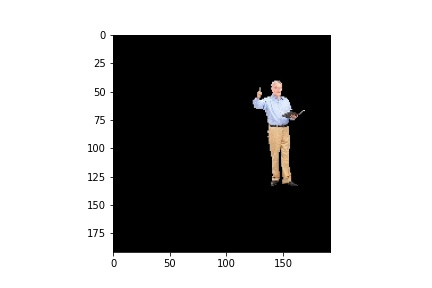

``
# Finally add both fg overlay and bg overlay images to get the fg_bg image
fg_bg = cv2.add(bg_overlay, fg_overlay) 
``
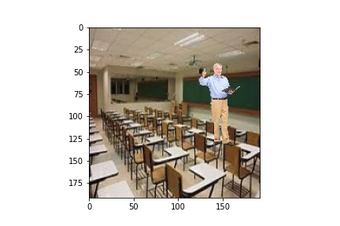
```
