## Assignment-15: Building a model for mask and depth map prediction for custom dataset where foreground are overlay over background and it equivalent ground truth mask and depth are given as target images.

* Custom Dataset and data loaded fucntions
* Data split: 70:30(train:test)
* Image augmentation techniques
* Experiment with different Loss fucntions
* Technique for Accuracy Calculation
* Experiment with various model architecture
* Strategy for beating 12 hours colab limitation run

## Dataset overview?

* Datasetsize: 400K
* Background theme: "Classroom"
* Foreground objects: student or/and teacher
* For building of model we need four kind of images: 
  * Input images: bg images, fg_bg images, 
  * Target Images: fg_bg mask images, fg_bg_depth images 
* For details on how dataset is created?, refer [(Link)](../assignment_A/)

Let's have quick summary of dataset and visulaization for each kind of images

**Dataset statistics**

Notebook: **EVAS15_dataset_statistic.ipynb**[(Link)](EVAS15_dataset_statistic.ipynb):

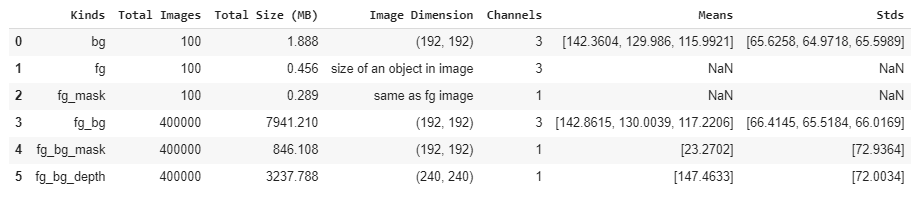

## Getting thing right, First Notebook?

First notebook approach was to ensure all necessay component are in place and verify with small dataset and tiny model.

1. Created end to end model pipeline
2. Created custom dataset class to load data from folder and handling data iterator
3. Created CNN model that take fg_bg and bg as inputs, having some conv layer chain  and generate predicted mask and depth map
4. Training of model, adding necessary logs to capture intermediate output, saving epoch results, saving epoch's data inputs, ground truth and predicted output 
5. Used time, memit for timing and memory profiling 
6. Used memory_profiler and line_profiler package for cell and statement profiling
7. Used psutil to capture memory usage in real time
8. Used tensorboard package to dump realtime profiling data for analysis
9. Timing Profiling:
  * how long it took to load data from disk
  * captured timing details for each convolution blocks and layers for the network
  * captured timing details while training model: execution time for forward, loss calculation and backpropagation
10. Memory Profiling:
  * Peak memory usage while loading data, preparing of dataset and data loader
  * memory usage for each epoch
11. All timing and memory usage logs are captured and passed to tensorboard for analysis.

### Custom Dataset Class, DepthMapDataset.py[(Link)](utils/DepthMapDataset.py): 

1. *Class: DepthMapDatasetZip*: This is dataset to read image from ZIP file
   * Reading is done once during object creation and store into RAM. this help to avoid reading file from disk during _getitem and speedup training time.
   * As this load all images into RAM, this class is suitable for limited dataset size that fit into RAM
   * Creating custom dataset class by inherting torch.utils.data.Dataset and overide __len__ and __getitem__ methods:
2. *Class: DepthMapDatasetFolder*
   * Dataset to read images from folder
   * This will slow the training as every time getitem is called image is read from file system
   * As all images are not loaded at once in RAM, so suitable to training large dataset
   * Creating custom dataset class by inherting torch.utils.data.Dataset and overide __len__ and __getitem__ methods:
   
### Memory Profiling and Timing Profiling, TimeMemoryProfile.py [(Link)](utils/TimeMemoryProfile.py)

1. Used time, memit for timing and memory profiling 
2. Used memory_profiler and line_profiler package for cell and statement profiling
3. Used psutil to capture memory usage in real time
4. Used tensorboard package to dump realtime profiling data for analysis
5. Training Timing Profiling: following timing is captured:
  * how long it took to load data from disk
  * Time taken for forward passed
  * Time taken for loss calculation
  * Time taken for back propagation
6. Memory Profiling:
  * Peak memory usage while training.
7. All timing and memory usage logs are captured and passed to tensorboard for analysis.
  
### Model utilities functions, depth_model_utils.py [(Link)](utils/depth_model_utils.py) 
1. model build, train, test, load model, save modle are defined in this file. 
2. memory and timing profiling are capture under this file 

### Model Architecture
There models design and trained. 
1. DMNet_CNN.py [(Link)](models/depthmap/DMNet_CNN.py): 
  * This is CNN based light weight model and used for experimental and analysiing various loss function.
  * Model is used for traiing on short dataset size (15232 training samples) for quick analysis.
2. DMNet_CNN_V1.py [(Link)](models/depthmap/DMNet_CNN_V1.py):  
  * Capacity is added to above CNN model to increase model efficiency
  * Trained on entire dataset(280K training samples)
3. DMNet_Resnet.py [(Link)](models/depthmap/DMNet_Resnet.py.py): 
  * Custom Resnet architetcure to have various global receiptive field to increase model efficiency
  * Trained on entire dataset(280K training samples)

### Data Augmentation
As we need to predict mask and depth map and these targets are not spatial invariance. any change in inputs images mean there ground truth mask and depth map remain no long valid.
so we need to think of image augmenttaion which are spatially invariance.

1. Data augmentation is applied on inputs features (bg and fg_bg images)
2. bg, fg_bg dataset is normalize using their mean and standard deviation calculated over entire 400k dataset
3. Contrast, brightness, saturation, hue type of image augmentation is applied for inputs features. ColorJitter transform is used.
4. Cut-out augmentation is applied. This randomaly cover the part of the images (bg, fg_bg). However when cut-out portion falls over foreground object boundarys, this might lead to predicting mask and depth diffeent than ground truth while training.
5. Data augmentation is applied only for training dataset set.
6. For testing dataset, only resize and necessary normalization is done.

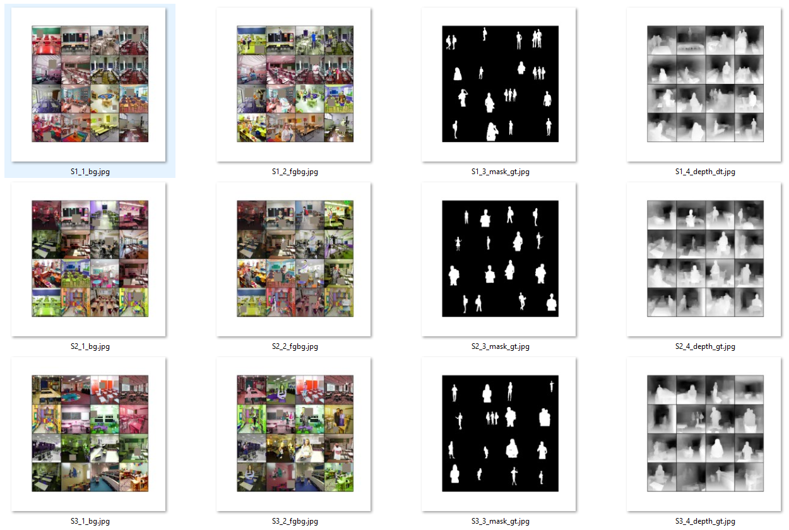

### Analysing how different loss functions calculate loss for two images.

*Notebook: EVA4S15_loss_algo_compare.ipynb* [(Link)](EVA4S15_loss_algo_compare.ipynb): 

In this notebook following five loss functions are analysed:
- kornia.losses.SSIM
- nn.SmoothL1Loss
- nn.MSELoss
- nn.BCEwithLogitsLoss
- nn.BCELoss

As we will be using loss functions for calculating loss for GT-Mask and Predicted-Mask as well as for GT-Depth and Predicted-Depth, so image samples are taken from the mask and depth dataset. 
- Mask images are in binary form: 0 or 255.
- Depth images are in gray scale: 0 to 255 scale

Various scenarios are considered and their loss values are calculated using different loss function.

**MASK IMAGES - BINARY**

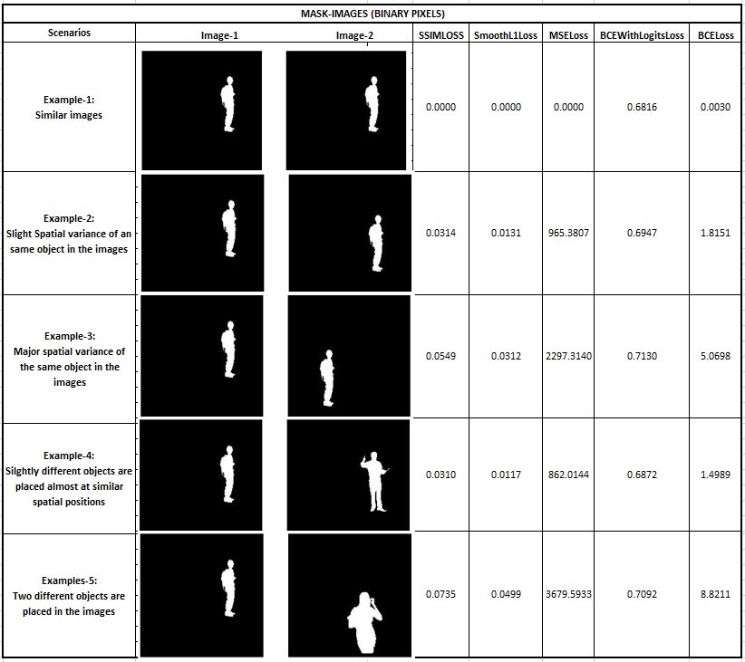

*DEPTH IMAGES - GRAY SCALE*

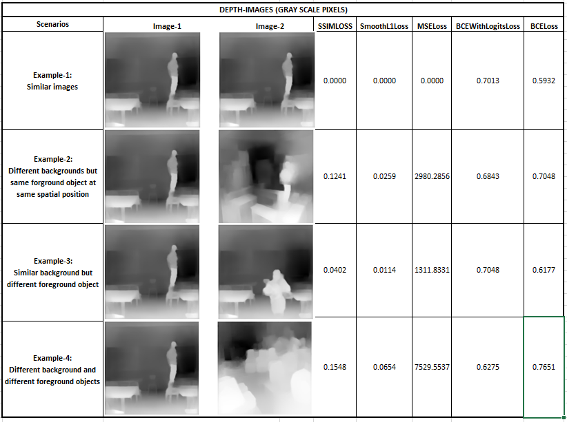

### Training Tiny CNN model for different Loss function

**Model Architecure used**: DMNet_CNN.py [(Link)](models/depthmap/DMNet_CNN.py): 
* Total params: 242,976
* Trainable params: 242,976
* Estimated Total Size (MB): 690.83
* Batch size = 32
* Trained for 30 Epochs

This model is trained for four different loss functions and their prediction results and accuracy are compared.
- Solution-1: Loss: BCEwithLogitsLoss [(Link)](EVA4S15_Main_CNN_BCEWithLogitsLoss_ShortData.ipynb): 
- Solution-2: Loss: SmoothL1Loss [(Link)](EVA4S15_Main_CNN_SmoothL1Loss_ShortData.ipynb): 
- Solution-3: Loss: MSELoss [(Link)](EVA4S15_Main_CNN_MSELoss_ShortData.ipynb): 
- Solution-4: Loss: SSIMLoss [(Link)](EVA4S15_Main_CNN_SSIMLoss_ShortData.ipynb): 

Model is trained with following configurations:

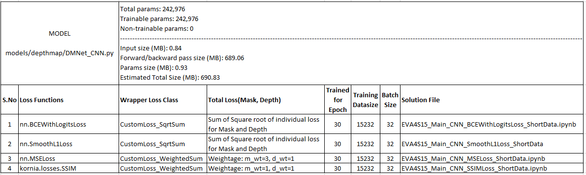

Test Prediction comparision for same test samples:

**Test Prediction for Loss: BCEwithLogitsLoss**

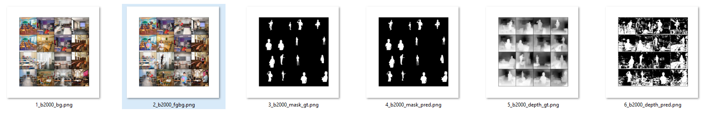

**Test Prediction for Loss: SmoothL1Loss**

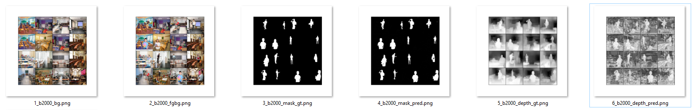

**Test Prediction for Loss: MSELoss**

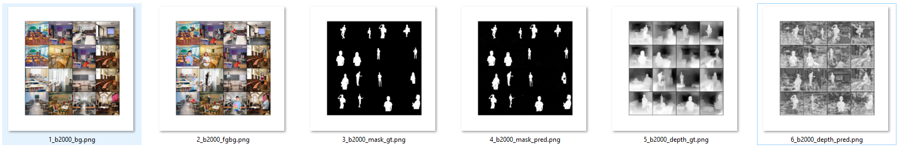

**Test Prediction for Loss: SSIMLoss**

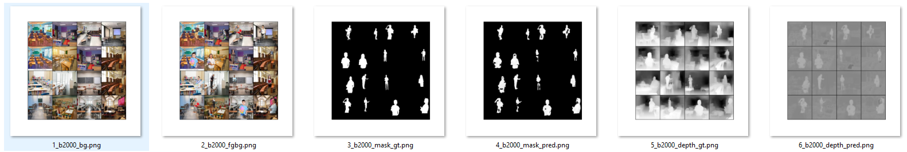

**Accuracy Results**, EVA4S15_AccuracyCalculation [(Link)](EVA4S15_AccuracyCalculation.ipynb):

To analyse which loss function is having better efficiency, the Accuracy for each model is calculated over 120K unseen test dataset.
Result is as below

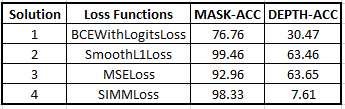

For accuracy calculation and technique, refer EVA4S15_AccuracyCalculation [(Link)](EVA4S15_AccuracyCalculation.ipynb): 

Lets have a look on how model with different loss fucntions are predicting mask and depth for same test sample.

**Accuracy: Loss: BCEwithLogitsLoss**

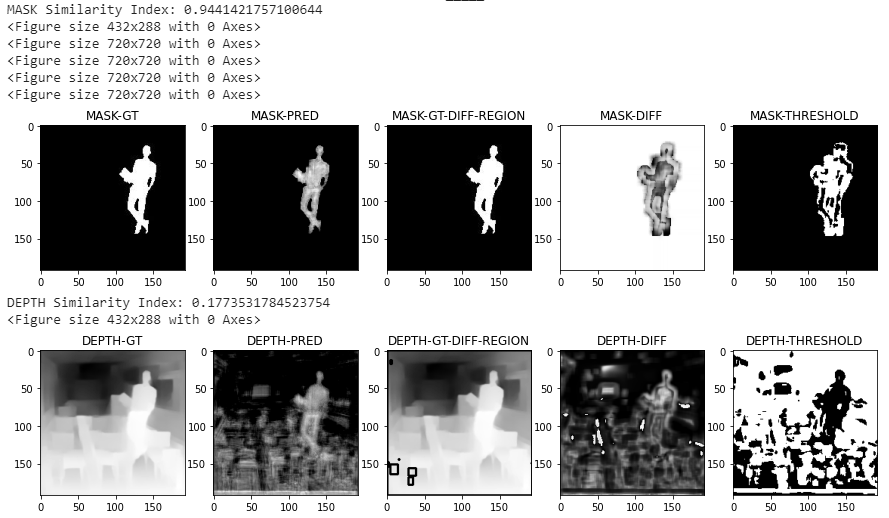

**Accuracy: Loss: SmoothL1Loss**

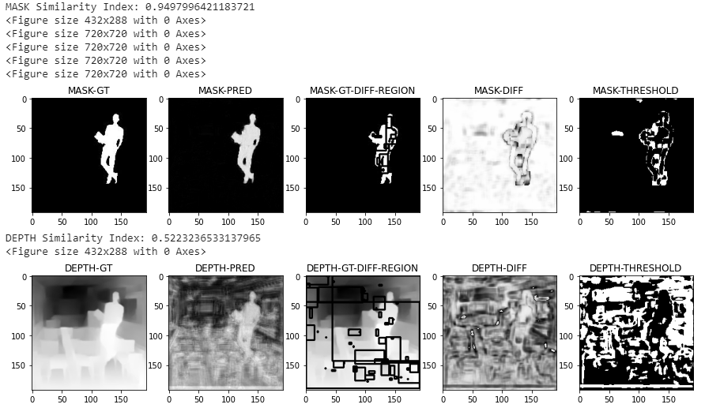

**Accuracy: Loss: MSELoss**

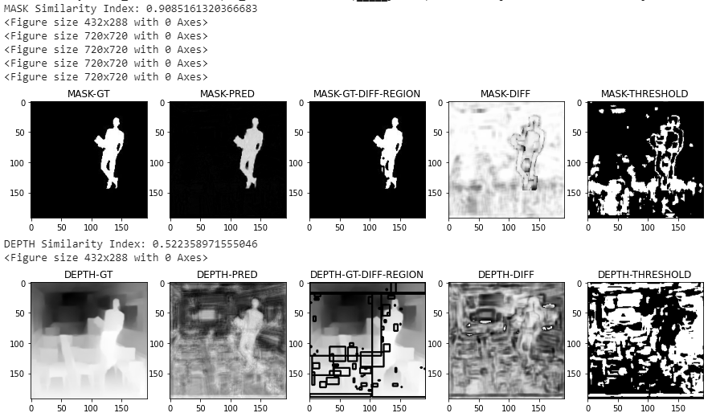

**Accuracy: Loss: SSIMLoss**

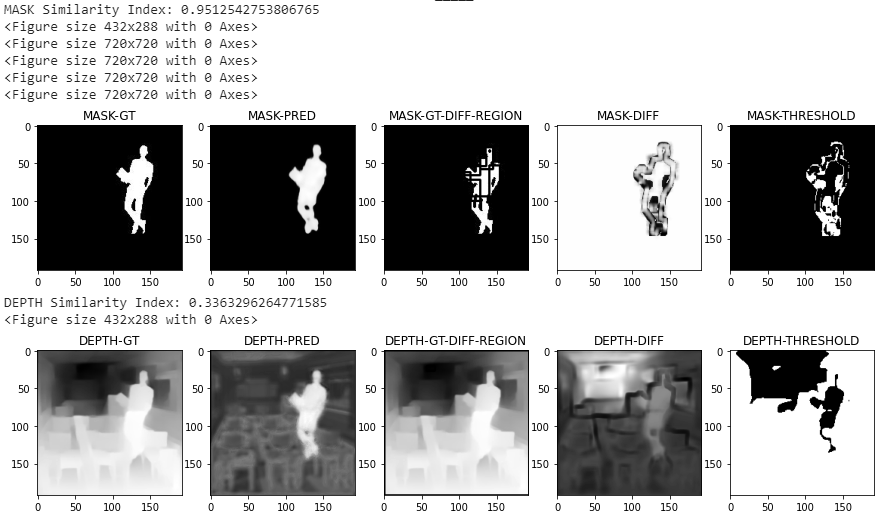

**Now we have all the things and components in place and it's time to desing model and train for entire dataset**

**Custom CNN Architecture**: 
* Solution Notebook: EVA4S15_Main_CNN_V1_BCEWithLogitsLoss_400k.ipynb [(Link)](EVA4S15_Main_CNN_V1_BCEWithLogitsLoss_400k.ipynb):
* Model Arch: DMNet_CNN_V1.py [(Link)](models/depthmap/DMNet_CNN_V1.py):

**Custom Resnet Architecture** 
* Model Arch: DMNet_Resnet.py [(Link)](models/depthmap/DMNet_Resnet.py):
2. It is executed in two part:
* Part1: EVA4S15_Main_Resnet_BCELogitsLoss_400k_Part1.ipyn [(Link)](EVA4S15_Main_Resnet_BCELogitsLoss_400k_Part1.ipynb). 
  * Model is executed for 6 epochs and its learned weight and optimizer states are saved
* Part2 : EVA4S15_Main_Resnet_BCELogitsLoss_400k_Part2.ipynb [(Link)](EVA4S15_Main_Resnet_BCELogitsLoss_400k_Part2.ipynb):
  * Part 1 trained model is reloaded and traning is resumed upto 19 epochs 

**Test Results: Custom CNN**

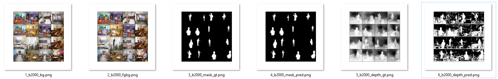

**Test Results: Custom Resnet**

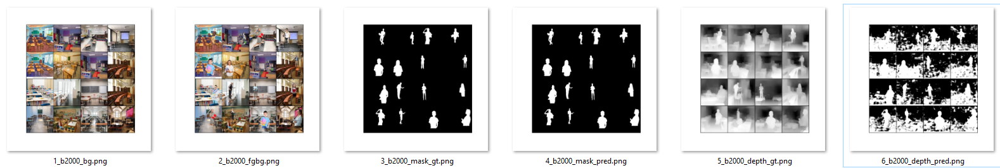

Lets have a look on how two different model predicting mask and depth for same test sample.

**Custom CNN**

**Custom Resnet**

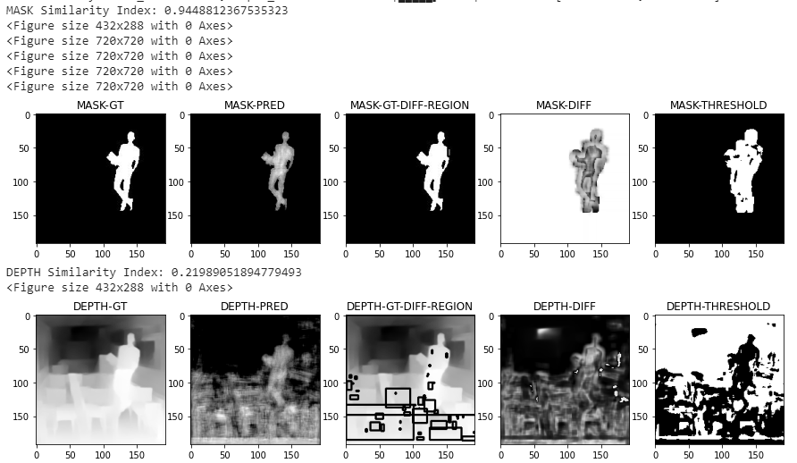

