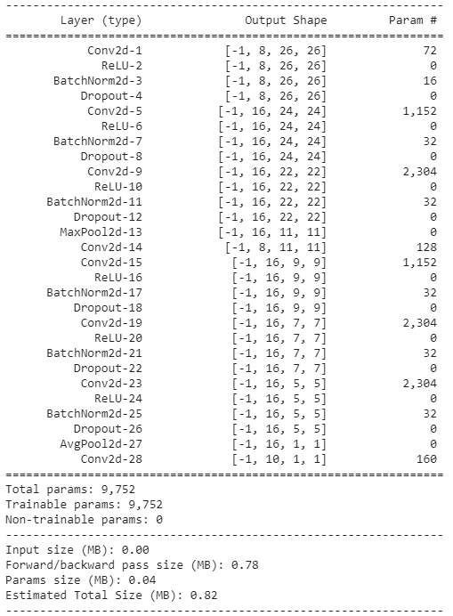
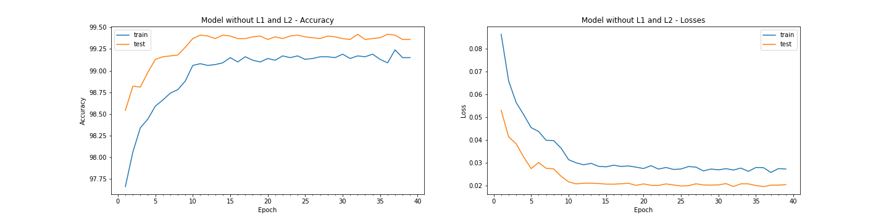
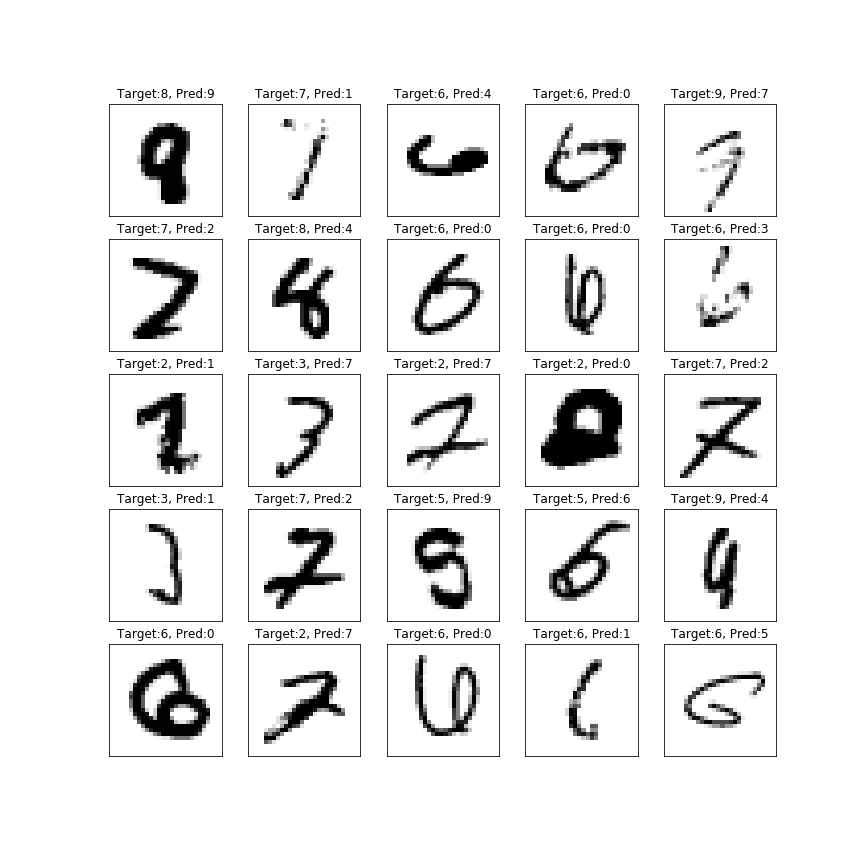
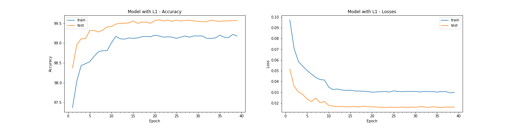
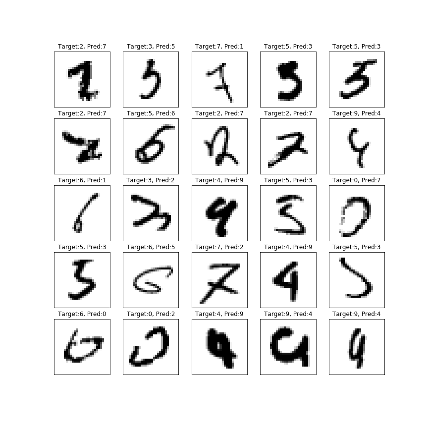
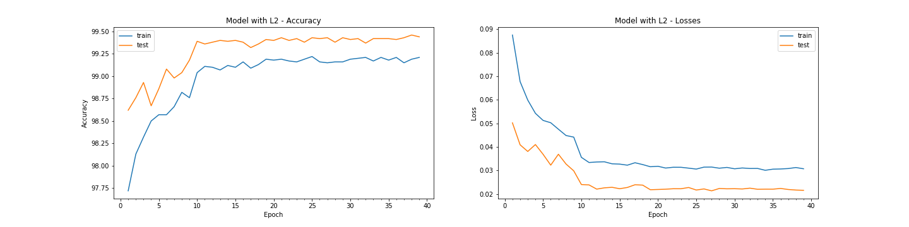
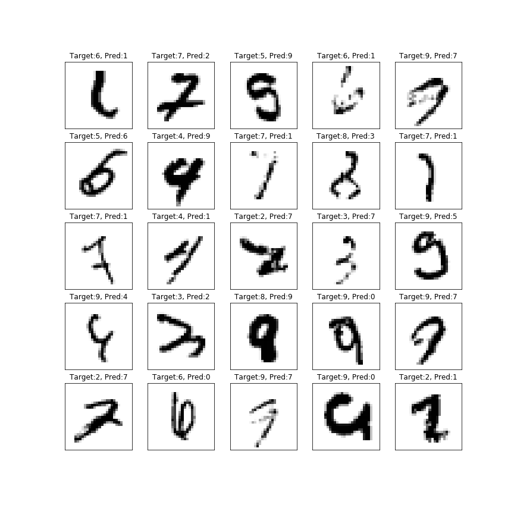
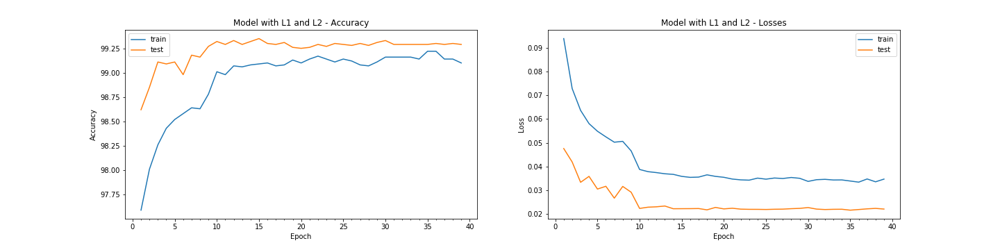
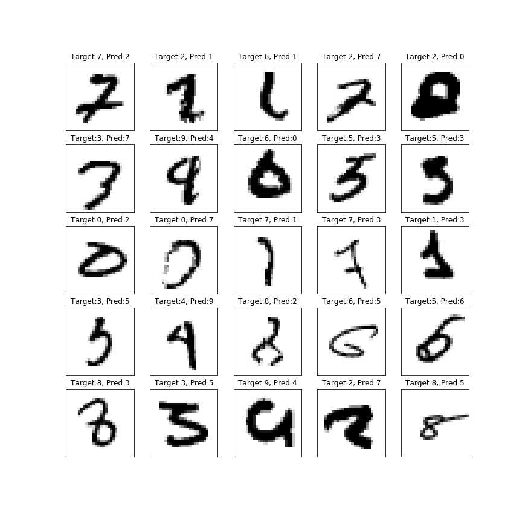
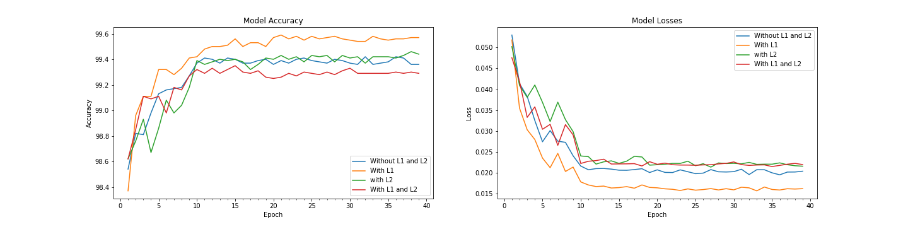

# Assignment-6: MNIST Model with L1, L2 Regularization

### what is in this notebook?
-----------------------------
Base working model is taken from session-5 and notebook is re-factored such that same fucntions can be reused for running model with different configurations.
Following changes are added:
1. Utility function are added for plotting model history, misclassified images and for comparing models
2. Regularization Functions added: L1 loss
3. Functions for train, test and building models
4. Four model are build by calling smae fucntions with different configuration:
4.1 witout L1 and L2
4.2 with L1
4.3 with L2
4.4 with L1 and L2
5. Model history is plotted for each model and their train and validation accuracy and loss changes are observed
6. 25 misclassified images are plotted for each model
7. Finally consolidated plot is drawn to observer validation accuracy and validation losses for all the models. This provide overview of impact of L1 and L2 regularization on the model.

###Further work:
----------------
1. codes are now avaialble in functional form and will be seggregrated in their respective files and whereever required will create classes for easily managing these apis. 

### Model Architecture which is tried with various Regularization:

----------------------------------------------------------------------------------------------------------------

### Model without L1 and L2
---------------------------

Result: 
1. Parameters: 9,752
2. Best Train Accuracy: 99.24 
3. Best Test Accuracy : 99.42. Most of the times test accuracy varies between 99.36 ~ 99.42.

Analysis:
1. Model is overfitting. Train accuracy is less compared to test accuracy  and this might be due to transformation images in train dataset.
2. Model still have capacity to push further to improve efficiency. 

Model Epoch History

Misclassified Images

----------------------------------------------------------------------------------------------------------------

### Model with L1
-----------------

Result: 
1. Parameters: 9,752
2. Best Train Accuracy: 99.22 
3. Best Test Accuracy : 99.59. Epoch-2 onward accuracy is above 99.50

Analysis:
1. Model is overfitting. Gap between train and test accuracy is increased compared to model without L1/L2 regularization. Test accuracy is increased and is quite high compare to train accuracy
2. Due to L1 regularization, features which are not contributing much are penalized heavily
3. Train accuracy does not changes much compared to previous model but L1 regularization has improved the generalization and made model generic.  
4. Model still have capacity to push further to improve efficiency. 
5. As we can observed in the misclassified images, few digits have some part missing or partially written. Further image augmentaion might further help to improve accuracy.
cutout strategy can be tried further.

Model Epoch History

Misclassified Images

### Model with L2
-----------------

Result: 
1. Parameters: 9,752
2. Best Train Accuracy: 99.21
3. Best Test Accuracy : 99.46. Mostly accuracy is above 99.40

Analysis:
1. Model is overfitting. Gap between train and test accuracy is increased compared to model without L1/L2 regularization. Test accuracy is increased and is quite high compare to train accuracy
2. L2 loss helped to increase test accuracy but train accuracy does not changes much but L2 regularization has improved the generalization and made model generic.  
3. Model still have capacity to push further to improve efficiency. 
4. As we can observed in the misclassified images, few digits have some part missing or partially written. Further image augmentaion might further help to improve accuracy.
cutout strategy can be tried further.
5. Image number 1, 3, 7, 10, 13, 16, 18, 22 and 25 are really tough images to classify. We might need more rotations, segmeted bluring, cutout strategy to exepreiment. 

Model Epoch History

Misclassified Images

### Model with L1 and L2
------------------------

Result: 
1. Parameters: 9,752
2. Best Train Accuracy: 99.22
3. Best Test Accuracy : 99.35 at Epoch 15. Mostly accuracy is between 99.27~99.30

Analysis:
1. Model is overfitting. Gap between train and test accuracy is reduced compared to model without L1/L2 regularization. 
2. Here train accuracy does not change much but it reduces the test accuracy. 
2. Loss in test accuracy is due to cascading effect of using both L1 and L2 together 

Model Epoch History

Misclassified Images

### Model Comparision: Visualization for validation accuracy and validation losses for all models together
----------------------------------------------------------------------------------------------------------

