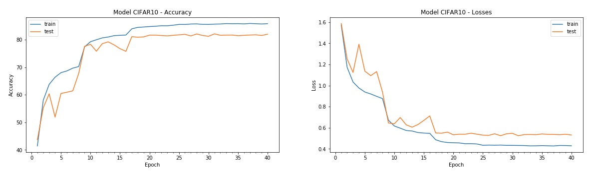

# Assignment-7: CIFAR10 Model using Depthwise Seperable Convolution and dilation Convolution for few layers

### Files Descriptions
----------------------
Reusable codes are packages into their respective python files as below:

1. data_utils.py: This file contaon code for loading CIFAR10 dataset, transformation fxn and data loader unitility functions
2. plot_utils.py: All image handling and plotting function are packaged into thsi file. Few funtions such as visualizing images dataset, plotting model hsitory, plotting misclassified images for the built model etc.
3. model_utils.py: Funtions and classes to build model. It also contains train and test functions. Various configution parameteres are profided to choose the loss and regularization selections.
it also contains building blocks for creating basic convolution blocks, transistion blocks, and depth wise seperable convoltuion layers.
4. cifar10_net.py: This file is speicifc for CIFAR10 network. it contains class for CIFAR10 network design.
5. EVA4S7_main.ipynb: This is notebook for creating the solution as per problem statement. It integrate all the necessary functions from custom files. 

### CIFAR10 Network Design:
---------------------------

1. Four Convolution Blocks are used. Each Blocks contains two convolution layers.
2. Each convolution layer is created using Conv2d_BasicBlock class(from model_utils.py): it is basis conv2d block having: conv layer -> BN -> RELU -> Dropout
3. Network also contains few Depthwise Seperable Convolution layers at the last convolution block which is created using Conv2d_Seperable class: Depth convolution followed by pointwise convolution
4. Dilation convolution is used in second convolution block using dialation=2
5. Model is build and trained using L1 and L2 Regularization

----------------------------------------------------------------------------------------------------------------

### Model Results
-----------------

Result: 
1. Parameters: 77,056
2. Best Train Accuracy: 85.91 at Epoch=36 
3. Best Test Accuracy : 82.14 at Epoch=30, and 80+ test accuracy is seen from Epoch=16 onwards.

Analysis:
1. Model is overfitting. 
2. Model still have capacity to push further to improve efficiency. 
3. Image augmentation can be used to further regularize the model
4. We might need different GRF for each classes. Restnet kind of model might work better. To be expereiment.

Model Test accuracy for each classes:

Model Epoch History

Misclassified Images

----------------------------------------------------------------------------------------------------------------

