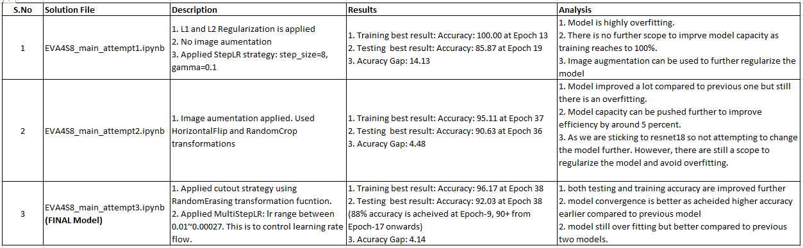
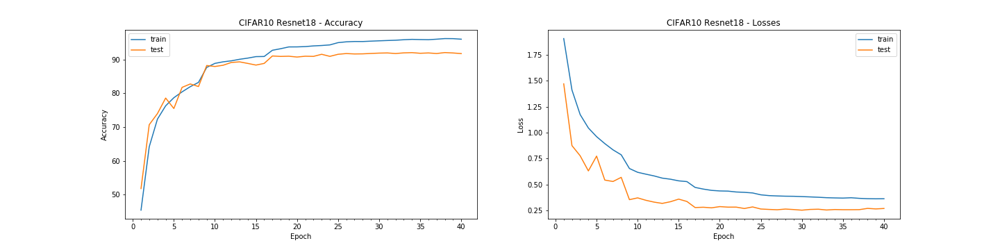
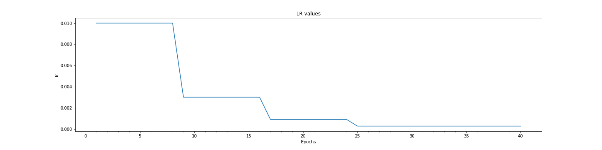

# Assignment-8: CIFAR10 Model using Resnet18 network architetcure

### Utility Files Descriptions
------------------------------
Reusable codes are packages into their respective python files as below:

1. data_utils.py: This file contaon code for loading CIFAR10 dataset, transformation fxn and data loader unitility functions
2. plot_utils.py: All image handling and plotting function are packaged into thsi file. Few funtions such as visualizing images dataset, plotting model hsitory, plotting misclassified images for the built model etc.
3. model_utils.py: Funtions and classes to build model. It also contains train and test functions. Various configution parameteres are profided to choose the loss and regularization selections.
it also contains building blocks for creating basic convolution blocks, transistion blocks, and depth wise seperable convoltuion layers.
4. cifar10_net_cnn.py: This file is speicifc for CIFAR10 network. it contains class for CIFAR10 network design based on custom CNN architetcure.
5. resnet.py: resnet network architetcure
6. model_history.py: it define ModelHistory class whcih store epoch based result for training and test data and utility fxn for plotting model history graph

### Basic Implementation Strategy
-----------------------------------

Three solutions are created in incremented mannner using resnet18 based network design. It integrate all the necessary functions from custom files. 

1. mean and std calculation for entire CIFAR10 dataset
2. Applying data normalization using calculated mean and std.
3. resnet18 based model creation.
4. build and model training using L1 and L2 regularization(weight_decay: 0.001)
5. StepLR: step_size=8, gamma=0.1
6. MultiStepLR: milestones=[8,16,24], gamma=0.3
7. Various Image augmentation techniques in steps are applied to avoid overfitting

----------------------------------------------------------------------------------------------------------------

### Consolidated summary and result comparisions
------------------------------------------------

### Detailed overview of the final solutions
--------------------------------------------

Solution file: EVA4S8_main_attempt3.ipynb

### Mean and standard devistion calculation for entire dataset

Total dataset(train+test) shape:  (60000, 32, 32, 3)
means: (0.49186864, 0.48265335, 0.44717798)
stds: (0.24697131, 0.24338901, 0.26159254)

Final Result:
1. Training best result: Accuracy: 96.17 at Epoch 38
2. Testing  best result: Accuracy: 92.03 at Epoch 38 (88+ accuracy is acheived at Epoch-9 onward, 90+ accuracy from Epoch-17 onwards)
3. Acuracy Gap: 4.14

Model Test accuracy for each classes:

Model Epoch History

Learning Rate Plot

Misclassified Images

----------------------------------------------------------------------------------------------------------------

