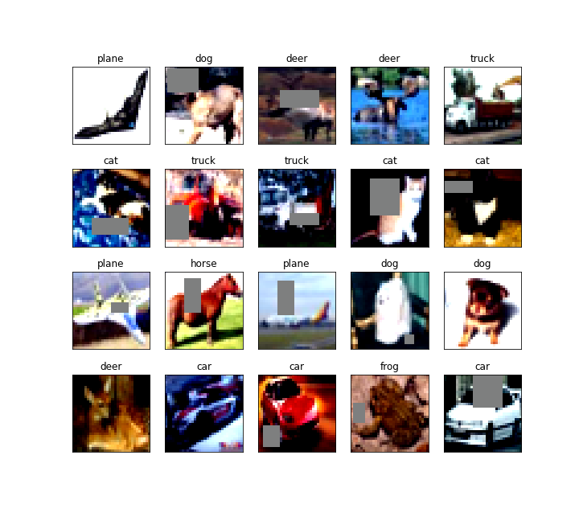
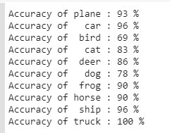
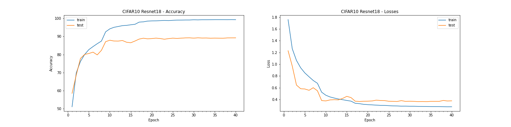
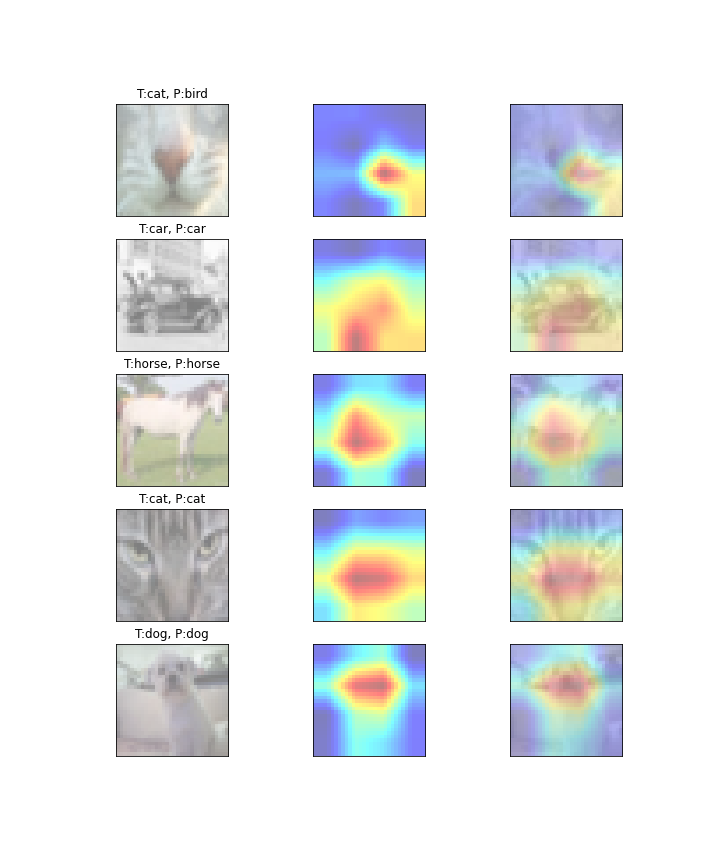

# Assignment-9: 

1. CIFAR10 Model using Resnet18 network architetcure
2. Data augmentation using albumentations library
3. GradCAM to visulaize how network is classifying the images

Solution file: EVA4S9_main.ipynb
--------------------------------

### Utility Files Descriptions
------------------------------
Reusable codes are packages into their respective python files as below:

### Folders: utils, models, gradcam

Folder: \utils\
1. utils\data_utils.py: This file contaon code for loading CIFAR10 dataset, transformation fxn and data loader unitility functions
2. utils\plot_utils.py: All image handling and plotting function are packaged into thsi file. Few funtions such as visualizing images dataset, plotting model hsitory, plotting misclassified images for the built model etc.
3. utils\model_utils.py: Funtions and classes to build model. It also contains train and test functions. Various configution parameteres are profided to choose the loss and regularization selections.
it also contains building blocks for creating basic convolution blocks, transistion blocks, and depth wise seperable convoltuion layers.
4. utils\model_history.py: it define ModelHistory class whcih store epoch based result for training and test data and utility fxn for plotting model history graph
5. utils\regularization.py: L1 loss fxn
6. utils\common_utils.py: basic common fx such as checking GPU device etc
7. utils\albumentations_utils.py: data augmentation and transformation using albumentations

Folder: \models\
This is folder to place all models for reuse in future
1. cifar10_net_cnn.py: This file is speicifc for CIFAR10 network. it contains class for CIFAR10 network design based on custom CNN architetcure.
2. resnet.py: resnet network architetcure

Folder: \gradcam\
1. gradcam\gradcam.py: Calculate GradCAM salinecy map
2. gradcam\gradcam_utils.py: Make heatmap from mask and synthesize GradCAM result image using heatmap and img. registring of layer for whcih GradCAM to be applied.
3. gradcam\gradcam_abs.py: abstraction layer for application to use GradCAM

----------------------------------------------------------------------------------------------------------------

Mean and standard devistion calculation for entire dataset
----------------------------------------------------------

Total dataset(train+test) shape:  (60000, 32, 32, 3)

means: (0.49186864, 0.48265335, 0.44717798)
stds: (0.24697131, 0.24338901, 0.26159254)

Sample images of albumentations augmentation
--------------------------------------------

Final Result:
-------------

1. Training best result: Accuracy: 99.37 at Epoch 39
2. Testing  best result: Accuracy: 89.27 at Epoch 31

Model Test accuracy for each classes:
-------------------------------------

Model Epoch History
-------------------

GradCAM Results visualization:
-----------------------------

----------------------------------------------------------------------------------------------------------------

